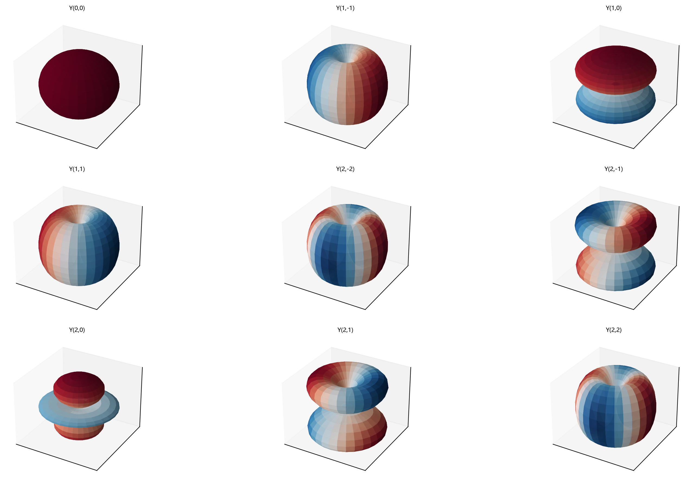

# 3D球谐函数可视化

一个用于绘制和可视化球谐函数（Spherical Harmonics）3D图像的Python工具。

## 特性

- 🎨 高质量3D可视化
- 🌐 自动配置中文字体支持
- 📊 支持单个或多个球谐函数对比
- 🎯 简单易用的API

## 安装

### 依赖要求

- Python 3.7+
- numpy
- matplotlib
- scipy

### 安装步骤

1. 克隆仓库：
```bash
git clone https://github.com/yourusername/SphericalHarmonics.git
cd SphericalHarmonics
```

2. 安装依赖：
```bash
pip install -r requirements.txt
```

## 快速开始

### 基本使用

运行主脚本：

```bash
python spherical_harmonics_3d.py
```

这将生成两个示例图像：
- `spherical_harmonic_Y21.png` - 单个球谐函数 Y(2,1) 的3D图像
- `spherical_harmonics_multiple.png` - 多个低阶球谐函数的网格图

### Python代码示例

```python
from spherical_harmonics_3d import plot_spherical_harmonic_3d, plot_multiple_harmonics
import matplotlib.pyplot as plt

# 绘制单个球谐函数
fig, ax = plot_spherical_harmonic_3d(l=3, m=2)
plt.show()

# 绘制多个球谐函数对比
fig = plot_multiple_harmonics(l_max=3)
plt.show()
```

## 参数说明

### 球谐函数参数

- **l (角动量量子数)**: 整数，必须 >= 0
- **m (磁量子数)**: 整数，必须满足 -l <= m <= l

### 常用球谐函数

- **Y(0,0)**: s轨道，球对称
- **Y(1,-1), Y(1,0), Y(1,1)**: p轨道（3个）
- **Y(2,-2), Y(2,-1), Y(2,0), Y(2,1), Y(2,2)**: d轨道（5个）
- **Y(3,-3) 到 Y(3,3)**: f轨道（7个）

## API文档

### `spherical_harmonic_3d(l, m, resolution=50)`

生成3D球谐函数数据。

**参数:**
- `l`: 角动量量子数
- `m`: 磁量子数
- `resolution`: 分辨率（默认50）

**返回:**
- `x, y, z`: 3D坐标数组
- `colors`: 归一化的颜色值数组

### `plot_spherical_harmonic_3d(l, m, figsize=(10, 10), colormap='RdBu_r')`

绘制单个球谐函数的3D图像。

**参数:**
- `l`: 角动量量子数
- `m`: 磁量子数
- `figsize`: 图形大小元组
- `colormap`: matplotlib颜色映射名称

**返回:**
- `fig, ax`: matplotlib图形和坐标轴对象

### `plot_multiple_harmonics(l_max=2, figsize=(15, 15))`

绘制多个球谐函数的子图网格。

**参数:**
- `l_max`: 最大l值
- `figsize`: 图形大小元组

**返回:**
- `fig`: matplotlib图形对象

## 示例图片

### 单个球谐函数示例

球谐函数 Y(2,1) 的3D可视化：


### 多个球谐函数对比

低阶球谐函数（l=0 到 l=2）的完整对比图：



运行示例脚本查看更多示例：

```bash
python example_usage.py single      # 绘制多个示例
python example_usage.py interactive # 交互式选择
python example_usage.py multiple    # 查看所有低阶球谐函数
```

## 技术细节

- 球谐函数使用 `scipy.special.sph_harm` 计算
- 3D可视化基于球谐函数的绝对值作为半径
- 颜色映射表示球谐函数的正负值（红色为正，蓝色为负）
- 自动支持Windows、macOS和Linux的中文字体

## 许可证

本项目采用 MIT 许可证。详情请查看 [LICENSE](LICENSE) 文件。

## 贡献

欢迎提交 Issue 和 Pull Request！

## 作者

小雪犬
